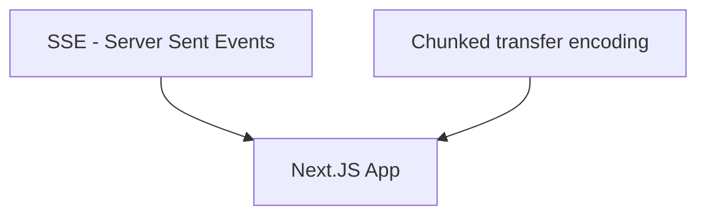

---
# try also 'default' to start simple
theme: seriph
# random image from a curated Unsplash collection by Anthony
# like them? see https://unsplash.com/collections/94734566/slidev
background: /images/background.jpg
# apply any windi css classes to the current slide
class: 'text-center'
# https://sli.dev/custom/highlighters.html
highlighter: shiki
# show line numbers in code blocks
lineNumbers: false
# some information about the slides, markdown enabled
info: |
  ## Movie Remake Generator
  Presentation slides for developers.
# persist drawings in exports and build
drawings:
  persist: false
# page transition
transition: slide-left
# use UnoCSS
css: unocss
---

# Docking with AI: Supercharge Your App with ChatGPT

How to get started with AI in your apps

<div class="pt-12">
  <span @click="$slidev.nav.next" class="px-2 py-1 rounded cursor-pointer" hover="bg-white bg-opacity-10">
    Press Space for next page <carbon:arrow-right class="inline"/>
  </span>
</div>

<div class="abs-br m-6 flex gap-2">
  <a href="https://github.com/vLX42" target="_blank" alt="GitHub"
    class="text-xl slidev-icon-btn opacity-50 !border-none !hover:text-white">
    <carbon-logo-github />
  </a>
</div>


---
layout: two-cols
image: /images/linkedin-qr.png
transition: fade-out
---

<template v-slot:default>

# Peter Biro

- **Role**: Frontend Developer at DFDS
- **Team**: Digital Freight Tribe
- **Experience**: Web development for 25 years

<br />
<br />

- vlx.dk
- www.linkedin.com/in/vlx42
- github.com/vLX42

</template>
<template v-slot:right>

[](https://www.linkedin.com/in/vlx42/)
</template>

<!--
I've been a web developer for 25 years, watching the web's continuous evolution. I believe React has some exciting changes ahead, not just with AI but also with React server components. It reminds me of my early days with WinCgi in Delphi. We are again without session variables (for now), relying on client-side cookies. Mostly because its all runing on the Edge functions and because everthing is being rewriten right now. 

I hope this talk can give you some insight in how you can use Ai in your projects not for writing your code but to utilize it to make your apps better.

How many of you have tried to use the openAI API, not the online version of chatGPT

Sorry, you might not learn anything new from this talk.
-->

---
layout: image-left-33
image: /images/intro.jpg
---

# Content


I would like to cover the following:


- What did i make
- OpenAi - The basic how do you use it
- Vercel AI SDK
- Streamed response
- Improving on the solution
- Langchain
- GPDR and your options

<!--
Here's a brief list of topics I'll cover. I might go through some points quickly to fit within our allotted time.
-->

---
layout: image-left-33
image: /images/sw.jpg
---

# What did i make - Hollywood Movie Remake Generator

## OpenAI & Cloudflare Integration
- **ChatGPT**: Generates movie remakes.
- **Replicate & Stable Diffusion**: Used for character post creation and enhanced image generation.
- **Cloudflare**: Caching and image storage.

## Site Functionality
- Fetches movie titles from **TheMovieDB**.
- Uses **ChatGPT** for remake generation.
- Character and image generation  with **Stable Diffusion**.

[movie-remake.vlx.dk](https://movie-remake.vlx.dk/)

<!--
Here at DFDS, we have what's called the Frontend Community, where we engage in knowledge sharing and more. I was looking for an excuse to dive into a side project. After enduring another butchered Hollywood remake, I thought, "Why not use ChatGPT to butcher my childhood classics and automate the remake process?"

This app taps into TheMovieDB to pull movie details and then lets ChatGPT butcher them further. ChatGPT also crafts prompts to create character posters using stable diffusion.

Right now, the solution is deployed on Vercel, with the AI function running as a CloudFront worker. I'll explain the 'why' behind this setup during the presentation.

But first, a quick demo to give you a taste of what I'm talking about.
-->

---
transition: fade-out
---


<v-clicks>

</v-clicks>

<!--
I relied heavily on ChatGPT for this project, especially when estimating costs if my site went viral. However, I think ChatGPT knows me a bit too well now and has started being mean to me.

But on a serious note, I did spend $20 just preparing for this talk by running numerous requests with GPT-4. Always set a limit, just in case! :)

And im using Cloudflair because it has some good options for Key/value storage and image storage. To cache the requests just in case.
-->

---
layout: image-left-33
image: /images/nextjs2.png
---

# Searching with Next.js and SSR :)

This is what's needed to fetch from The Movie DB. No packages required; everything happens on the server :)

```ts {all|2|4|6|all}
export default async function Page({ params }: { params: { search: string } }) {
  const movieData = await searchMovies(params.search);
  return (
    <Suspense fallback={<MovieSearchResultSkeleton />}>
      {/* @ts-expect-error Async Server Component */}
      <MovieSearchResult promise={movieData} />
    </Suspense>
  );
}
```
<br>
```ts {all}
export async function searchMovies(searchTerm: string): Promise<any> {
    const res = await fetch(
      `https://api.themoviedb.org/3/search/movie?api_key=${process.env.THEMOVIEDB_API_KEY}&query=${searchTerm}`,
      { method: "GET", headers: { "Content-Type": "application/json" } }
    );
}
```

<!--
I just have to highlight this, because SSR (Server-Side Rendering) is so exciting. This is the search function for my app, all running on the server using just native React/Next.js code. No packages required.
-->

---
layout: image-left-33
image: /images/robot.jpg
---

# OpenAI

This is a simple example of OpenAi request

```ts {all|2|3-8|4|5|6|7|11|12|all}
    const payload: OpenAIStreamPayload = {
      model: "gpt-3.5-turbo",
      messages: [
        {"role": "system", "content": "You are a helpful assistant."},
        {"role": "user", "content": "Who won the world series in 2020?"},
        {"role": "assistant", "content": "The Los Angeles Dodgers won the World Series in 2020."},
        {"role": "user", "content": "Where was it played?"}
      ],
      temperature: 0.9,
      presence_penalty: 0.6,
      max_tokens: 340,
      stream: true,
    };
```

<!--
Let's kick things off with some OpenAI content. This is a straightforward request sent to OpenAI, utilizing ChatGPT 3.5.
-->

---
layout: image-left-33
image: /images/robot.jpg
---

# OpenAI

Example of my questions

```ts {all|1-9|10-13|14-17|all}
      {
        name: "Me",
        message: `Create a modern version of the movie called "${title}" that was released in ${releaseDate}?
          The updated the plot for a modern audience by including themes of woke-ness, LGBT representation, diversity, and inclusion into the plot.
          If the main character in the original movie is male, please consider gender-swapping the character.
          Find new actors for the different roles, they should look  like the original actors. Also consider actors that are not known for mainstream movies. Don't use: Zendaya, Emma Stone, Michael B. Jordan.
          Write a medium lenght synopsis of the movie, without revealing its title.
          Including the names of the new actors`,
      },
      {
        name: "AI",
        message: "",
      },
      {
        name: "Me",
        message: "Find a title for this remake. Return title only",
      },
      {
        name: "AI",
        message: "",
      },
      {
        name: "Me",
        message: `Use the lead actor from the summary to create a character poster. Don't mentioning the character's name in the description use the actors name.
          Keep the appearance of the character faithful to the original, including clothing and style details.
          Use the main element of the movie for the background. Avoid using terms like "AI" or "generate."
          Keep the response brief, with no more than 85 words. Make it in a style like this:
          (cinematic portrait of ((super mario:1.0) and (princess peach:1.0):1.0) in ((avengers movie:1.0):1.0), (hyperrealism, skin, sharp detail, octane render, soft light:0.9), (by (dave dorman:1.0):1.1)`,
      },
```
---
transition: fade-out
layout: image-left-33
image: /images/robot.jpg
---

# Vercel AI SDK

The easy way to get starting

### Api
```ts {all|9|13-17|all}
// ./app/api/chat/route.js
import OpenAI from 'openai'
import { OpenAIStream, StreamingTextResponse } from 'ai'

const openai = new OpenAI({
  apiKey: process.env.OPENAI_API_KEY
})

export const runtime = 'edge'

export async function POST(req) {
  const { messages } = await req.json()
  const response = await openai.chat.completions.create({
    model: 'gpt-4',
    stream: true,
    messages
  })
  const stream = OpenAIStream(response)
  return new StreamingTextResponse(stream)
}
```

<!--
Vercel has developed a great AI SDK that's worth checking out, especially if you're considering building an app with chat functionality or something similar. I'll discuss scenarios where it might make more sense to create a custom solution.

Normal serverless function 
Hobby: 10
Pro: 60
Enterprise: 900

No limits for edge functions (yet) But they need to start responding within 30 secounds
-->

---
transition: fade-out
layout: image-left-33
image: /images/robot.jpg
---

# Vercel AI SDK


### Frontend
```ts {all|5|9-13|15-21|all}
// ./app/page.js
'use client'
import { useChat } from 'ai/react'
export default function Chat() {
  const { messages, input, handleInputChange, handleSubmit } = useChat()

  return (
    <div>
      {messages.map(m => (
        <div key={m.id}>
          {m.role}: {m.content}
        </div>
      ))}

      <form onSubmit={handleSubmit}>
        <input
          value={input}
          placeholder="Say something..."
          onChange={handleInputChange}
        />
      </form>
    </div>
  )
}
```


---
transition: fade-out
layout: two-cols
---
<template v-slot:default>
Using the Vercel AI SDK - useChat chained together.

```ts {all|18-25|7-9|all}
  const {
    messages: aiImagePrompts,
    setMessages: setAiImagePromptMesssages,
    append: appendAiPrompt,
  } = useChat({
    api: "/api/chat/normal",
    onFinish: (message) => {
      generateImage(message.content, "Your title here"); // Replace "Your title here" with the desired title
    },
  });

  const {
    messages: remakeTitleMessages,
    append: appendTitle,
    setMessages,
  } = useChat({
    api: "/api/chat/normal",
    onFinish: (message) => {
      setNewTitle(message.content);
      setAiImagePromptMesssages([...remakeTitleMessages]);
      appendAiPrompt({
        role: "user",
        content: `Use the lead actor from the summary to create a character poster.`,
      });
    },
  });
```
  </template>
<template v-slot:right>
&nbsp;
```ts {all}
  const { messages: plot, append } = useChat({
    onFinish: (message) => {
      setMessages([message]);
      appendTitle({
        role: "user",
        content: `Find a title for this remake. Return title only`,
      });
    },
  });
```
<v-clicks>

</v-clicks>
</template>

---
transition: fade-out
layout: center
---


---
transition: fade-out
layout: two-cols
---


<template v-slot:default>
Using the Vercel AI SDK - `experimental_StreamData`.

```ts {all|10|23-26|all}
  export async function POST(req: Request) {
  const { messages } = await req.json()
 
  const response = await openai.chat.completions.create({
    model: 'gpt-3.5-turbo-0613',
    stream: true,
    messages,
    functions
  })
  const data = new experimental_StreamData()
  const stream = OpenAIStream(response, {
    experimental_onFunctionCall: async (
      { name, arguments: args },
      createFunctionCallMessages
    ) => {
      if (name === 'get_current_weather') {
        // Call a weather API here
        const weatherData = {
          temperature: 20,
          unit: args.format === 'celsius' ? 'C' : 'F'
        }
 
        data.append({
          text: 'Some custom data'
        })
 


```
  </template>
<template v-slot:right>
&nbsp;
```ts {all|13|16|23|all}
        const newMessages = createFunctionCallMessages(weatherData)
        return openai.chat.completions.create({
          messages: [...messages, ...newMessages],
          stream: true,
          model: 'gpt-3.5-turbo-0613'
        })
      }
    },
  onCompletion(completion) {
      console.log('completion', completion)
    },
    onFinal(completion) {
      data.close()
    },

    experimental_streamData: true
  })

  data.append({
    text: 'Hello, how are you?'
  })

  return new StreamingTextResponse(stream, {}, data)
}

```

</template>


---
layout: image-left-33
image: /images/streaming.jpg
---

# Streaming the Response to the Client


<div class="flex justify-center items-center">

</div>
<v-clicks>

Why is streaming important with AI?
</v-clicks>

<v-clicks>

- Because AI responses can be slow
- It provides users with early feedback
- It conserves server resources
- It optimizes network resource usage
- It looks cool :)

</v-clicks>

<!--
This was the initial challenge I faced while working on this side project. I aimed to achieve a smooth streaming effect for the public ChatGPT. I was unaware of Vercel's Edge function's streaming capability until after I had completed my implementations with Cloudflare workers and AWS Lambdas. This led me to explore how streaming responses function.

I'll discuss two methods to achieve this. Of course, there are other techniques, such as using socket.io or an HTTP/2 approach.
-->

---
layout: image-left-33
image: /images/streaming.jpg
---

# SSE - Server Sent Event


| Feature/Aspect       | SSE Capabilities and Limitations |
|----------------------|----------------------------------|
| **HTTP Method**      | - Uses `GET`, so no `POST` bodies.|
| **Query Strings**    | - Supports query strings.         |
| **Request Body**     | - Can't send a request body.      |
| **Headers**          | - Can set headers, but some browser limits.|


---
layout: image-left-33
image: /images/streaming.jpg
---

# The Next.js way
Next.js API
```ts {all|3-8|10-13|all}
export default function handler(request: NextRequest) {
  let { readable, writable } = new TransformStream();
  var headers = new Headers();
  headers.append("Content-Type", "text/event-stream");
  headers.append("Connection", "keep-alive");
  headers.append("Access-Control-Allow-Origin", "*");
  headers.append("Access-Control-Allow-Methods", "GET, POST, PUT, DELETE"); 
  
  export async function sendEvent(writer, data) {
    let encoder = new TextEncoder();
    await writer.write(`event: add\ndata: ${JSON.stringify(data)}\n\n`);
  };
  return new NextResponse(readable, init);
```
React.js code:

```ts {all|2|3-5|all}
 useEffect(() => {
    const source = new EventSource( `/api/remake?releaseDate=${releaseDate}&title=${title}`);
    source.addEventListener("add", (e: any) => {
        const json = JSON.parse(e.data);
    });
    ... error handling and cleanup
  }, []);
```


---
layout: image-left-33
image: /images/streaming.jpg
---

# Cloudflair Worker
SSE Server Sent Events
```ts {all|1-3|8-16|21|all}
addEventListener("fetch", (event) => {
  event.respondWith(fetchAndApply(event.request));
});

async function fetchAndApply(request) {
  let { readable, writable } = new TransformStream();
  var headers = new Headers();
  headers.append("Content-Type", "text/event-stream");
  headers.append("Cache-Control", "no-cache");
  headers.append("Connection", "keep-alive");
  headers.append("Access-Control-Allow-Origin", "*");
  headers.append(
    "Access-Control-Allow-Headers",
    "Origin, X-Requested-With, Content-Type, Accept"
  );
  headers.append("Access-Control-Allow-Methods", "GET, POST, PUT, DELETE");
  const url = new URL(request.url);
  const title = url.searchParams.get("title");
  const releaseDate = url.searchParams.get("releaseDate");

  askQuestions(title, releaseDate, writable);
  return new Response(readable, init);
}
```
---
layout: image-left-33
image: /images/streaming.jpg
---

# Cloudflair Worker
SSE Server Sent Events
```ts {all|1-5|20|all}
async function sendEvent(writer, data) {
  let encoder = new TextEncoder();
  await writer.write(encoder.encode(`event: add\n`));
  await writer.write(encoder.encode(`data: ${JSON.stringify(data)}\n\n`));
}

async function askQuestions(title, releaseDate, writable) {
      ...
      const stream = await OpenAIStream(payload);
      const reader = stream.getReader();
      const decoder = new TextDecoder();
      let output = "";
      let done = false;

      while (!done) {
        const { value, done: doneReading } = await reader.read();
        done = doneReading;
        const chunkValue = decoder.decode(value);
        output += chunkValue;
        await sendEvent(writer, { reply: i, message: chunkValue });
      }


```


---
layout: image-left-33
image: /images/streaming.jpg
---

# Chunked Transfer Encoding


| Feature/Aspect            | Chunked Transfer Encoding Considerations |
|---------------------------|------------------------------------------|
| **HTTP Method**           | - Works with various methods (`GET`, `POST`|
| **Data Integrity**        | - Ensure chunks are correctly assembled on client side.|
| **Performance**           | - Small chunks can decrease efficiency.|
| **Client Support**        | - Not all clients handle chunked encoding well.|
| **Intermediary Servers**  | - Some proxies/buffers might not support or could alter chunked data.|


---
layout: image-left-33
image: /images/streaming.jpg
---

# AWS Lambda response streaming
```ts {all|7-14|20|all}
exports.handler = awslambda.streamifyResponse(
  async (event, responseStream, context) => {
    const queryStringParameters = event.queryStringParameters;
    const title = queryStringParameters ? queryStringParameters.title : null;
    const releaseDate = queryStringParameters ? queryStringParameters.releaseDate : null;

    const httpResponseMetadata = {
      statusCode: 200,
      headers: {
        "Content-Type": "application/json",
        "Transfer-Encoding": "chunked",
      },
    };

    responseStream = awslambda.HttpResponseStream.from(
      responseStream,
      httpResponseMetadata
    );

    await askQuestions(title, releaseDate, responseStream);

    responseStream.end();
  }
);
```
---
layout: image-left-33
image: /images/streaming.jpg
---
# AWS Lambda response streaming
```ts {all|12|all}
      const stream = await OpenAIStream(payload);
      const reader = stream.getReader();
      const decoder = new TextDecoder();
      let output = "";
      let done = false;

      while (!done) {
        const { value, done: doneReading } = await reader.read();
        done = doneReading;
        const chunkValue = decoder.decode(value);
        output += chunkValue;
        responseStream.write({ reply: i, message: chunkValue });
      }
```


---
layout: image-left-33
image: /images/streaming.jpg
---
# AWS Lambda response streaming

The React.js part

```ts {all|5|9-23|20-21|all}
useEffect(() => {
    const fetchData = async () => {
      try {
        const response = await fetch(`${process.env.AWS_REMAKE_URL}?releaseDate=${releaseDate}&title={title`);
        const reader = response.body?.getReader();
        const decoder = new TextDecoder("utf-8");
        if (reader) {
          let buffer = "";
          const readChunk = async () => {
            const { value, done } = await reader.read();
            if (done) {
              return;
            }
            buffer += decoder.decode(value, { stream: true });
            let newlineIndex;
            while ((newlineIndex = buffer.indexOf("\n")) !== -1) {
              const jsonStr = buffer.slice(0, newlineIndex);
              buffer = buffer.slice(newlineIndex + 1);
              if (jsonStr !== "" && jsonStr !== "[]") {
                const json = JSON.parse(jsonStr);
                ... do stuff
              }
            }

            readChunk();
          };

          readChunk();
        }
      } catch (error) {
        console.error("Error fetching data:", error);
      }
    };

    fetchData();
  }, []);
```

---
layout: image-left-33
image: /images/streaming.jpg
---
# AWS Lambda response streaming
Learn more about AWS Lambda response streaming:

https://aws.amazon.com/blogs/compute/introducing-aws-lambda-response-streaming/

For a code example, check out:

https://github.com/aws-samples/serverless-patterns/tree/main/lambda-streaming-ttfb-write-sam

---
layout: image-left-33
image: /images/construction.jpg
---

# Improving on the solution

### Don't expect chatGPT to give you random responses
<br>
<center>

</center>

---
layout: image-left-33
image: /images/construction.jpg
---

# Improving on the Solution

### Don't expect ChatGPT to give you random responses.

Randomize your question

```ts {all}
  const topics = [
    "Diverse casting: Remakes feature more diverse casts, promoting representation on screen.",
    "Updated references: Cultural references, jokes, or language are modernized for today's audience.",
    "Gender swaps: Key characters' genders may be swapped, offering fresh perspectives.",
    "Environmental themes: Remakes may incorporate environmental messages or eco-friendly practices.",
    "Modernized settings: Settings and backdrops are updated to reflect contemporary life.",
    "Social issues: Themes like mental health or LGBTQ+ rights may be included to raise awareness.",
    "Expanded female roles: Female characters are given more agency and complex storylines.",
    "Evolving dynamics: Character dynamics change, such as introducing same-sex relationships.",
    "Tonal shifts: The tone may be altered to fit contemporary preferences, e.g., more comedic.",
    "Reinterpretation: Remakes take creative liberties, altering storylines or characters.",
  ];

  // Randomly select 2-3 topics for the plot.
  const selectedTopics = topics
    .sort(() => 0.5 - Math.random())
    .slice(0, Math.floor(Math.random() * 2) + 2);
```


---
layout: image-left-33
image: /images/construction.jpg
---

# ChatGPT functions call
Looking up the movie, to support never movies than from 2021

Setup function definition

```ts {all}
const functions: ChatCompletionFunctions[] = [
  {
    name: "get_movie_info",
    description: "Get movie information based on movieId",
    parameters: {
      type: "object",
      properties: {
        movieId: {
          type: "string",
          description: "The movieId",
        },
      },
      required: ["movieId"],
    },
  },
];
```


---
layout: image-left-33
image: /images/construction.jpg
---

# ChatGPT Functions Call

Call the API. The question needs to be clear enough for the model to understand that it should call the function.

```ts {all|5|all}
  const response = await openai.createChatCompletion({
    model: "gpt-4-0613",
    stream: true,
    messages: replacedMessages,
    functions ,
  });
```


---
layout: image-left-33
image: /images/construction.jpg
---

# ChatGPT Functions Call

Call the API. The question needs to be clear enough for the model to understand that it should call the function.

```ts {all|5|6-7|10|all}
 const stream = OpenAIStream(response, {
    experimental_onFunctionCall: async (
      { name, arguments: args }, createFunctionCallMessages
    ) => {
      if (name === "get_movie_info") {
         //logic that get the moiveDetails
         newMessages = createFunctionCallMessages(movieDetails as any);

        return openai.createChatCompletion({
          messages: [...messages, ...newMessages],
          stream: true,
          model: "gpt-4-0613",
          functions,
        });
      }
    },
  });
```


---
layout: image-left-33
image: /images/brain.jpg
---

# Why Embedding Over Training?


- **Speed**: Embedding is quicker than training.
- **Cost-Effective**: Less computational resources.
- **Precision**: Ensure the model has exact information.
- **Flexibility**: Update without retraining.


---
layout: image-left-33
image: /images/brain.jpg
---

# What are Vector Stores?


<center>

</center>


---
layout: image-left-33
image: /images/brain.jpg
---

# How to get the vector
```ts {all}
  const result = await openai.createEmbedding({
    model: 'text-embedding-ada-002', 
    'My text',
  });
```

#### Response

```ts {all}
{
  "data": [
    {
      "embedding": [
        -0.006929283495992422,
        -0.005336422007530928,
        ...
        -4.547132266452536e-05,
        -0.024047505110502243
      ],
      "index": 0,
      "object": "embedding"
    }
  ],
  "model": "text-embedding-ada-002",
  "object": "list",
  "usage": {
    "prompt_tokens": 5,
    "total_tokens": 5
  }
}
```

---
layout: image-left-33
image: /images/chain.jpg
---

# What is LangChain?

LangChain is a framework designed for the development of applications powered by language models. It offers:

- **Data-awareness**: The ability to connect a language model to various data sources.
- **Agentic Capabilities**: Allowing a language model to interact with its environment.
- **Modular Components**: Abstractions for working with language models, making them easy to use and customize.
- **Off-the-shelf Chains**: Pre-structured assemblies of components for specific tasks.


---
layout: image-left-33
image: /images/chain.jpg
---

# LangChain Modules

- **Model I/O**: Interface directly with language models.
- **Data Connection**: Integrate with application-specific data.
- **Chains**: Construct and manage sequences of calls.
- **Agents**: Direct chains based on high-level directives.
- **Memory**: Persist application state between chain runs.
- **Callbacks**: Log and stream intermediate steps of any chain.


---
layout: image-left-33
image: /images/chain.jpg
---

# LangChain example code

```ts {all|3|all}
  const chain = ConversationalRetrievalQAChain.fromLLM(
    llm,
    vectorStore.asRetriever(5),
    {
      returnSourceDocuments: true,
      memory: new BufferMemory({
        chatHistory: chatHistory,
        memoryKey: 'chat_history',
        inputKey: 'question', // The key for the input to the chain
        outputKey: 'text', 
        returnMessages: true // If using with a chat model
      }),
      verbose: true,

      questionGeneratorChainOptions: {

        llm: nonStreamingModel
      }
    }
  )
```

---
layout: image-left-33
image: /images/chain.jpg
---

# LangChain build in prompts

```ts {all|1-8|12-20|all}
const qa_template = `Use the following pieces of context to answer the 
  question at the end. If you don't know the answer, just say that you 
  don't know, don't try to make up an answer.

  {context}

  Question: {question}
  Helpful Answer:`;


const question_generator_template = `Given the following conversation and 
  a follow up question, rephrase the follow up question to be a standalone 
  question.

  Chat History:
  {chat_history}
  Follow Up Input: {question}
  Standalone question:`;
```


---
transition: fade-out
---

# GPDR - OpenAi and Azure

| Feature/Aspect                 | OpenAI                                                      | Azure OpenAI                                                                                          |
|-------------------------------|------------------------------------------------------------|-------------------------------------------------------------------------------------------------------|                                                                                                   
| **Services**                  | ChatGPT, GPT-3, Code, DALL·E                               | Access to OpenAI’s models like GPT-3, etc                                              |                                                                                    |
| **Data Processing Location**  | Mostly within the US.                                      | Specific Azure regions: East US, South Central US, West Europe.                                       |
| **Data Encryption**           | -                                                          | Data encrypted with Microsoft managed keys. |
| **Data Retention**            | -                                                          | Data related to prompts, queries, responses stored temporarily for up to 30 days.                     |
| **Enterprise Features**       | -                                                          | Offers security, compliance, regional availability, and more.                                         |
| **Integration & Connectivity**| -                                                          | Integration with other Azure Cognitive services and network features for more control over the service.|


---
layout: image-left-33
image: /images/question.jpg
---
# Questions?


<v-clicks>


</v-clicks>
