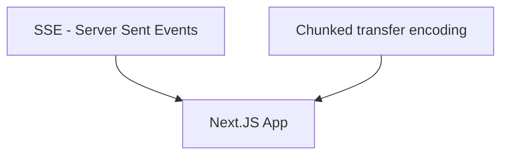

---
# try also 'default' to start simple
theme: seriph
# random image from a curated Unsplash collection by Anthony
# like them? see https://unsplash.com/collections/94734566/slidev
background: /images/background.jpg
# apply any windi css classes to the current slide
class: 'text-center'
# https://sli.dev/custom/highlighters.html
highlighter: shiki
# show line numbers in code blocks
lineNumbers: false
# some information about the slides, markdown enabled
info: |
  ## Movie Remake Generator
  Presentation slides for developers.
# persist drawings in exports and build
drawings:
  persist: false
# page transition
transition: slide-left
# use UnoCSS
css: unocss
---

# Docking with AI: Supercharge Your App with ChatGPT

How to get started with AI in your apps

<div class="pt-12">
  <span @click="$slidev.nav.next" class="px-2 py-1 rounded cursor-pointer" hover="bg-white bg-opacity-10">
    Press Space for next page <carbon:arrow-right class="inline"/>
  </span>
</div>

<div class="abs-br m-6 flex gap-2">
  <a href="https://github.com/vLX42" target="_blank" alt="GitHub"
    class="text-xl slidev-icon-btn opacity-50 !border-none !hover:text-white">
    <carbon-logo-github />
  </a>
</div>


---
layout: two-cols
image: /images/linkedin-qr.png
transition: fade-out
---

<template v-slot:default>

# Peter Biro

- **Role**: Frontend Chapter Lead at DFDS
- **Team**: Digital Freight Tribe
- **Experience**: Web development for 25 years

<br />
<br />

- vlx.dk
- www.linkedin.com/in/vlx42
- github.com/vLX42

</template>
<template v-slot:right>

[](https://www.linkedin.com/in/vlx42/)
</template>

<!--
I've been a web developer for 25 years, watching the web's continuous evolution. I believe React has some exciting changes ahead, not just with AI but also with React server components. It reminds me winCGI in Delphi when I started doing web development. We are again without session variables (for now), relying on client-side cookies. Mostly because its all runing on the Edge functions and because everthing is being rewriten right now. 

I hope this talk can give you some insight in how you can use Ai in your projects not for writing your code but to utilize it to make your apps.

How many of you have tried to use the openAI API, not the online version of chatGPT

Sorry, you might not learn anything new from this talk.
-->

---
layout: image-left-33
image: /images/intro.jpg
---

# Content


I would like to cover the following:


- What did i make?
- OpenAi - How it works
- Vercel AI SDK
- Streamed response
- Optimizing your solution
- Langchain
- Truth AI - Make your own QA chatbot
- Retrival
- Embedding

<!--
Here's a brief list of topics I'll cover. I might go through some points quickly to fit within our allotted time.
-->

---
layout: image-left-33
image: /images/sw.jpg
---

# What did i make? - Hollywood Movie Remake Generator

## OpenAI & Cloudflare Integration
- **ChatGPT**: Generates movie remakes.
- **Replicate & Stable Diffusion**: Used for character post creation and enhanced image generation.
- **Cloudflare**: Caching and image storage.

## Site Functionality
- Fetches movie titles from **TheMovieDB**.
- Uses **ChatGPT** for remake generation.
- Character and image generation  with **Stable Diffusion**.

[movie-remake.live](https://movie-remake.live/)

<!--
I make stupid or meaning less app from time to time, just to find a excuse to try new tech.

This was an excuese to play with openAI. I got the idea after enduring another Hollywood remake, I thought, "Why not use ChatGPT to butcher my childhood classics and automate the remake process?"

This app taps into TheMovieDB to pull movie details and then lets ChatGPT butcher them further. ChatGPT also crafts prompts to create character posters using stable diffusion.

Right now, the solution is deployed on Vercel, with the AI function running as a CloudFront worker. I'll explain the 'why' behind this setup during the presentation.

But first, a quick demo to give you a taste of what I'm talking about.

=== DEMO TIME ===
-->

---
transition: fade-out
---


<v-clicks>

</v-clicks>

<!--
I relied heavily on ChatGPT for this project, especially when estimating costs if my site went viral. However, I think ChatGPT knows me a bit too well now and has started being mean to me.

But on a serious note, I did spend $20 just preparing for this talk by running numerous requests with GPT-4. Always set a limit, just in case! :)

And im using Cloudflair because it has some good options for Key/value storage and image storage. To cache the requests just in case.
-->

---
layout: image-left-33
image: /images/robot.jpg
---

# OpenAI

This is a simple example of OpenAi request

```ts {all|2|3-8|4|5|6|7|9|10|11|all}
    const payload: OpenAIStreamPayload = {
      model: "gpt-3.5-turbo",
      messages: [
        {"role": "system", "content": "You are a helpful assistant."},
        {"role": "user", "content": "Who won the world series in 2020?"},
        {"role": "assistant", "content": "The Los Angeles Dodgers won the World Series in 2020."},
        {"role": "user", "content": "Where was it played?"}
      ],
      temperature: 0.9,
      max_tokens: 340,
      stream: true,
    };
```

<!--
Let's kick things off with some OpenAI content. This is a straightforward request sent to OpenAI, utilizing ChatGPT 3.5.

You define a model, pick the one that maches your usecase or budget

Messages: this is the memory of the conversation and it your responsbility to store it.

Temperatre: how certant is it?
max_tokens: depending on the questiong and the reply, long response? set it high, are you getting cut of in the response increase it

Stream: get the response chunk by chunk for better user experince.
-->

---
layout: image-left-33
image: /images/robot.jpg
---

# OpenAI

Example of my questions

```ts {all|1-9|10-13|13-15|19-23|all}
      {
        name: "Me",
        message: `Create a modern version of the movie called "${title}" that was released in ${releaseDate}?
          The updated the plot for a modern audience by including themes of woke-ness, LGBT representation, diversity, and inclusion into the plot.
          If the main character in the original movie is male, please consider gender-swapping the character.
          Find new actors for the different roles, they should look  like the original actors. Also consider actors that are not known for mainstream movies. Don't use: Zendaya, Emma Stone, Michael B. Jordan.
          Write a medium lenght synopsis of the movie, without revealing its title.
          Including the names of the new actors`,
      },
      {
        name: "AI", message: "",
      },
      {
        name: "Me",  message: "Find a title for this remake. Return title only",
      },
      {
        name: "AI", message: "",
      },
      {
        name: "Me",
        message: `Use the lead actor from the summary to create a character poster. Don't mentioning the character's name in the description use the actors name.
          Keep the appearance of the character faithful to the original, including clothing and style details.
          Use the main element of the movie for the background. Avoid using terms like "AI" or "generate."
          Keep the response brief, with no more than 85 words. Make it in a style like this:
          (cinematic portrait of ((super mario:1.0) and (princess peach:1.0):1.0) in ((avengers movie:1.0):1.0), (hyperrealism, skin, sharp detail, octane render, soft light:0.9), (by (dave dorman:1.0):1.1)`,
      },
```

<!--
This is an dumb down example of what i use in my app

I have follow up questions
-->

---
transition: fade-out
layout: image-left-33
image: /images/robot.jpg
---

# Vercel AI SDK

The easy way to get starting - chatbot in 50 lines of code

### Api
```ts {all|9|13-17|all}
// ./app/api/chat/route.js
import OpenAI from 'openai'
import { OpenAIStream, StreamingTextResponse } from 'ai'

const openai = new OpenAI({
  apiKey: process.env.OPENAI_API_KEY
})

export const runtime = 'edge'

export async function POST(req) {
  const { messages } = await req.json()
  const response = await openai.chat.completions.create({
    model: 'gpt-4',
    stream: true,
    messages
  })
  const stream = OpenAIStream(response)
  return new StreamingTextResponse(stream)
}
```

<!--
Vercel has developed a great AI SDK that's worth checking out, especially if you're considering building an app with chat functionality or something similar. I'll discuss scenarios where it might make more sense to create a custom solution.

Normal serverless function 
Hobby: 10
Pro: 60
Enterprise: 900

No limits for edge functions (yet) But they need to start responding within 25 secounds
-->

---
transition: fade-out
layout: image-left-33
image: /images/robot.jpg
---

# Vercel AI SDK


### Frontend
```ts {all|5|8-12|13-19|all}
// ./app/page.js
'use client'
import { useChat } from 'ai/react'
export default function Chat() {
  const { messages, input, handleInputChange, handleSubmit } = useChat()
  return (
    <div>
      {messages.map(m => (
        <div key={m.id}>
          {m.role}: {m.content}
        </div>
      ))}
      <form onSubmit={handleSubmit}>
        <input
          value={input}
          placeholder="Say something..."
          onChange={handleInputChange}
        />
      </form>
    </div>
  )
}
```

<!--
A hook called useChat

You get messages with all history

A form for submitting question

Storage of the previuse response are handled by the hook

I just works
-->
---
layout: image-left-33
image: /images/streaming.jpg
---

### THE END
<br/>

## You can now make a chatbot with the Vercel AI SDK...

<br/><br/>
<v-clicks>

Wait! How did you make the movie site, you ask?
</v-clicks>

<v-clicks>
<span style="color: #FF0000;">
Did you use the SDK?
</span>
</v-clicks>
<v-clicks>

No, I didn't. It wasn't available when I did it.
</v-clicks>
<v-clicks>
<span style="color: #FF0000;">
So would it be easy to make with the SDK?
</span>
</v-clicks>
<v-clicks>

Yes... and no, let me explain.
</v-clicks>

<!--
You can deploy it to the hobby version of vercel for free, the only thing that is costing your money is  openAI ussage.


Its not build for a specific usecase where you have multiple streams that need to be returned. They have started to add this, but it was still experimental last i looked.
-->

---
transition: fade-out
layout: two-cols
image: /images/streaming.jpg
---
<template v-slot:default>
Using the Vercel AI SDK - useChat chained together... 🤯
```ts {all|18-25|7-9|all}
  const {
    messages: aiImagePrompts,
    setMessages: setAiImagePromptMesssages,
    append: appendAiPrompt,
  } = useChat({
    api: "/api/chat/normal",
    onFinish: (message) => {
      generateImage(message.content, "Your title here"); // Replace "Your title here" with the desired title
    },
  });
  const {
    messages: remakeTitleMessages,
    append: appendTitle,
    setMessages,
  } = useChat({
    api: "/api/chat/normal",
    onFinish: (message) => {
      setNewTitle(message.content);
      setAiImagePromptMesssages([...remakeTitleMessages]);
      appendAiPrompt({
        role: "user",
        content: `Use the lead actor from the summary to create a character poster.`,
      });
    },
  });
```
  </template>
<template v-slot:right>
&nbsp;
```ts {all}
  const { messages: plot, append } = useChat({
    onFinish: (message) => {
      setMessages([message]);
      appendTitle({
        role: "user",
        content: `Find a title for this remake. Return title only`,
      });
    },
  });
```
<v-clicks>

</v-clicks>
</template>
<!--
BUT.. if you like i my case wan't to do multiple questions and stream all of them back to the client you need to do something like this
You chain your hooks, so when one i finished then the next start
-->

---
layout: image-left-33
image: /images/streaming.jpg
---

# Streaming the Response to the Client


<div class="flex justify-center items-center">

</div>
<v-clicks>

Why is streaming important with AI?
</v-clicks>

<v-clicks>

- Because AI responses can be slow
- It provides users with early feedback
- It conserves server resources
- It optimizes network resource usage
- It looks cool :)

</v-clicks>

<!--
This was the initial challenge I faced while working on this side project. I aimed to achieve a smooth streaming effect for the public ChatGPT.

I have made implemenation for vercel, and cloudfront


I'll discuss two methods to achieve this. Of course, there are other techniques, such as using socket.io or an HTTP/2 approach.
-->

---
layout: image-left-33
image: /images/streaming.jpg
---

# SSE - Server Sent Event


| Feature/Aspect       | SSE Capabilities and Limitations |
|----------------------|----------------------------------|
| **HTTP Method**      | - Uses `GET`, so no `POST` bodies.|
| **Query Strings**    | - Supports query strings.         |
| **Request Body**     | - Can't send a request body.      |
| **Headers**          | - Can set headers, but some browser limits.|


---
layout: image-left-33
image: /images/streaming.jpg
---

# The Next.js way
Next.js API (APP Router)
```ts {all|3-4|7|11-13|all}
export default function handler(request: NextRequest) {
  let { readable, writable } = new TransformStream();
  var headers = new Headers();
  headers.append("Content-Type", "text/event-stream");
  export async function sendEvent(writer, data) {
    let encoder = new TextEncoder();
    await writer.write(`event: add\ndata: ${JSON.stringify(data)}\n\n`);
  };
  return new NextResponse(readable, init);

  export const config = {
    runtime: 'edge', // for Edge API Routes only
  }
```
React.js code:

```ts {all|2|3-5|all}
 useEffect(() => {
    const source = new EventSource( `/api/remake?releaseDate=${releaseDate}&title=${title}`);
    source.addEventListener("add", (e: any) => {
        const json = JSON.parse(e.data);
    });
    ... error handling and cleanup
  }, []);
```

<!--
Header need to be set to the correct type: event-stream

Now you can start sending response to the client that will be streamed.

Important rember to set the config to make it run on the edge where you get long run

On the client you then create a EventSource (a browser api)

Then you just need to add a event listner
-->

---
layout: image-left-33
image: /images/streaming.jpg
---

# Chunked Transfer Encoding


| Feature/Aspect            | Chunked Transfer Encoding Considerations |
|---------------------------|------------------------------------------|
| **HTTP Method**           | - Works with various methods `GET`, `POST`|
| **Data Integrity**        | - Ensure chunks are correctly assembled on client side.|
| **Performance**           | - Small chunks can decrease efficiency.|
| **Client Support**        | - Not all clients handle chunked encoding well.|
| **Intermediary Servers**  | - Some proxies/buffers might not support or could alter chunked data.|


---
layout: image-left-33
image: /images/streaming.jpg
---

# Chunked response in next.js
```ts {all|2-4|8||10-13|17|20|all}
import { NextResponse } from 'next/server';
export const config = {
  runtime: "edge",
};
export default function handler(req, res) {
    res.writeHead(200, {
      'Content-Type': 'application/json',
      'Transfer-Encoding': 'chunked'
    });
    const jsonArray = [
      { id: 1, name: 'Alice' },
      { id: 2, name: 'Bob' },
    ];
    const streamData = (array, index) => {
      if (index < array.length) {
        const line = JSON.stringify(array[index]) + '\n';
        res.write(line); // Write a line as a chunk
        setTimeout(() => streamData(array, index + 1), 500);
      } else {
        res.end(); // No more data to write, end the response
      }
    };
    streamData(jsonArray, 0);
}

```

<!--
You again set you header to the correct format 

And then you start write to the client.
-->

---
layout: image-left-33
image: /images/streaming.jpg
---

# React reciving the data

```ts {all|5|9-23|19|all}
useEffect(() => {
    const fetchData = async () => {
      try {
        const response = await fetch(`${process.env.REMAKE_URL}?releaseDate=${releaseDate}&title={title`);
        const reader = response.body?.getReader();
        const decoder = new TextDecoder("utf-8");
        if (reader) {
          let buffer = "";
          const readChunk = async () => {
            const { value, done } = await reader.read();
            if (done) return;
            buffer += decoder.decode(value, { stream: true });
            let newlineIndex;
            while ((newlineIndex = buffer.indexOf("\n")) !== -1) {
              const jsonStr = buffer.slice(0, newlineIndex);
              buffer = buffer.slice(newlineIndex + 1);
              if (jsonStr !== "" && jsonStr !== "[]") {
                const json = JSON.parse(jsonStr);
                ... do stuff save it to a state etc.
              }
            }
            readChunk();
          };
          readChunk();
        }
      } catch (error) {
        console.error("Error fetching data:", error);
      }
    };

    fetchData();
  }, []);
```

<!--
Purpose: Fetch and process data in a React component using useEffect.
Fetching: Sends a request to a URL constructed with environment variables and parameters.
Reading: Uses a readable stream to process the response chunk by chunk.
Decoding: Converts each chunk into a UTF-8 string.
JSON Parsing: Splits the string by newlines and parses each as JSON.
Processing: Performs actions on valid JSON data.
Error Handling: Catches and logs any errors during fetching or processing.
-->

---
layout: image-left-33
image: /images/construction.jpg
---

# Improving on the solution

### Don't expect chatGPT to give you random responses
<br>
<center>

</center>

<!--
chatGPT has the tendensy to select the same actors over and over again. It don't have any memory so a simular prompt will give you simular responses.
-->

---
layout: image-left-33
image: /images/construction.jpg
---

# Improving on the Solution

### Don't expect ChatGPT to give you random responses.

Randomize your question

```ts {all}
  const topics = [
    "Diverse casting: Remakes feature more diverse casts, promoting representation on screen.",
    "Updated references: Cultural references, jokes, or language are modernized for today's audience.",
    "Gender swaps: Key characters' genders may be swapped, offering fresh perspectives.",
    "Environmental themes: Remakes may incorporate environmental messages or eco-friendly practices.",
    "Modernized settings: Settings and backdrops are updated to reflect contemporary life.",
    "Social issues: Themes like mental health or LGBTQ+ rights may be included to raise awareness.",
    "Expanded female roles: Female characters are given more agency and complex storylines.",
    "Evolving dynamics: Character dynamics change, such as introducing same-sex relationships.",
    "Tonal shifts: The tone may be altered to fit contemporary preferences, e.g., more comedic.",
    "Reinterpretation: Remakes take creative liberties, altering storylines or characters.",
  ];

  // Randomly select 2-3 topics for the plot.
  const selectedTopics = topics
    .sort(() => 0.5 - Math.random())
    .slice(0, Math.floor(Math.random() * 2) + 2);
```


---
layout: image-left-33
image: /images/construction.jpg
---

# ChatGPT functions call
Looking up the movie, to support never movies than from 2021

Setup function definition

```ts {all}
const functions: ChatCompletionFunctions[] = [
  {
    name: "get_movie_info",
    description: "Get movie information based on movieId",
    parameters: {
      type: "object",
      properties: {
        movieId: {
          type: "string",
          description: "The movieId",
        },
      },
      required: ["movieId"],
    },
  },
];
```

<!--
Right now the solution is limmited to movies before September 2021, and maybe it don't know the plot of a specific movie.

So chatGPT can now call your functions. It just need some information about it.
-->

---
layout: image-left-33
image: /images/construction.jpg
---

# ChatGPT Functions Call

Call the API. The question needs to be clear enough for the model to understand that it should call the function.

```text {all}
Make a remake of movieId:192, use the title from the response and
don't use movieId in the response
```
<br>
```ts {all|5|all}
  const response = await openai.createChatCompletion({
    model: "gpt-4-0613",
    stream: true,
    messages: replacedMessages,
    functions,
  });
```


---
layout: image-left-33
image: /images/construction.jpg
---

# ChatGPT Functions Call

Call the API. The question needs to be clear enough for the model to understand that it should call the function.

```ts {all|5|6-7|8|11|all}
 const stream = OpenAIStream(response, {
    experimental_onFunctionCall: async (
      { name, arguments: args }, createFunctionCallMessages
    ) => {
      if (name === "get_movie_info") {
         //logic that get the moiveDetails
         const movieDetails = getMovie(args.movieId)
         newMessages = createFunctionCallMessages(movieDetails as any);

        return openai.createChatCompletion({
          messages: [...messages, ...newMessages],
          stream: true,
          model: "gpt-4-0613",
          functions,
        });
      }
    },
  });
```


---
layout: image-left-33
image: /images/brain.jpg
---

# Embedding, Fine-tune or Training?

### Fine-tune:
- **Relative Speed**: Faster than training, slower than embedding.
- **Higher Cost**: More expensive than embedding.
- **Data Prep**: More intensive data curation than embedding.
- **Tuneable**: More adaptable than embedding but requires effort.

<br>

### Embedding:
- **Speed**: Embedding is quicker than training.
- **Cost-Effective**: Less computational resources.
- **Precision**: Ensure the model has exact information.
- **Flexibility**: Update without retraining.

---
layout: image-left-33
image: /images/brain.jpg
---

# Fine-tunning GPT

- Identify task-specific objectives.
- Collect relevant, high-quality datasets.
- Annotate data for model targets.
- Format data to match model requirements.

```json
{
   "messages":[
      {
         "role":"system",
         "content":"Marv is a factual chatbot that is also sarcastic."
      },
      {
         "role":"user",
         "content":"What's the capital of France?"
      },
      {
         "role":"assistant",
         "content":"Paris, as if everyone doesn't know that already."
      }
   ]
```
---
layout: image-left-33
image: /images/brain.jpg
---
# GPT-3.5 Turbo Price Comparison

| Model                 | Training Cost | Input Cost | Output Cost |
|-----------------------|---------------|------------|-------------|
| **Normal**               | N/A           | $0.0010 / 1K tokens | $0.0020 / 1K tokens |
| **Fine-tuned**             | $0.0080 / 1K tokens | $0.0030 / 1K tokens | $0.0060 / 1K tokens |


If we have 1,000 users using 2,000 tokens each:

| Model                        | Total Input Cost | Total Output Cost | Total Cost |
|------------------------------|------------------|-------------------|------------|
| **Normal**            | $2.00            | $4.00             | $6.00      |
| **Fine-tuned**| $6.00            | $12.00            | $18.00     |

---
layout: image-left-33
image: /images/brain.jpg
---

# What is Embedding in LLM?

Transforming data into numerical vectors for model comprehension.

- **Retrieval**: Stores vectors in a database for efficient information retrieval.

- **Embedding**: Integrates vectors into prompts to enhance response relevance.

<!--
You need a retrieval function where you take some text and put it into a vector database

A embeding part that find the relevant text and embed it into the prompt
-->

---
layout: image-left-33
image: /images/brain.jpg
---

# What are Vector Stores?


<center>

</center>

<!--
it will take a text and transform it into a vector, this a an example of a 3 demension vector to make a illustration

dog is one one side 

Fruit is on the other side.

In reality is many more dimensions
-->

---
layout: image-left-33
image: /images/brain.jpg
---

# How to get the vector
```ts {all}
  const result = await openai.createEmbedding({
    model: 'text-embedding-ada-002',
    'My text',
  });
```

#### Response

```ts {all}
{
  "data": [
    {
      "embedding": [
        -0.006929283495992422,
        -0.005336422007530928,
        ...
        -4.547132266452536e-05,
        -0.024047505110502243
      ],
      "index": 0,
      "object": "embedding"
    }
  ],
  "model": "text-embedding-ada-002",
  "object": "list",
  "usage": {
    "prompt_tokens": 5,
    "total_tokens": 5
  }
}
```

<!--
32000 charaters and calulate a vector in secounds

But what to do with the vector?

You need to store it somewhere.

I can be stored in redis/posgres or some other kind of database

But there some real good tooling out there to help with all this.

And its called langchain
-->

---
layout: image-left-33
image: /images/chain.jpg
---

# What is LangChain?

LangChain is a framework designed for the development of applications powered by language models. It offers:

- **Data-awareness**: The ability to connect a language model to various data sources.
- **Agentic Capabilities**: Allowing a language model to interact with its environment.
- **Modular Components**: Abstractions for working with language models, making them easy to use and customize.
- **Off-the-shelf Chains**: Pre-structured assemblies of components for specific tasks.

<!--
Langchain is a swizz army knife for embedding your own data into a language model.

It is a bit opinonate, and the documentation could be better.
-->

---
---

<Youtube id="e6MHpdkbcAQ" width="100%" height="100%"/>


<!--
Lets look at a small demo
-->


---
layout: image-left-33
image: /images/chain.jpg
---

# LangChain retrival

Build in functions for reading documents
```ts {all}
      const directoryLoader = new DirectoryLoader(
      "documents",
      {
        ".pdf": (path) => new PDFLoader(path),
        ".docx": (path) => new DocxLoader(path),
        ".txt": (path) => new TextLoader(path),
        ".md": (path) => new TextLoader(path),
        ".mdx": (path) => new TextLoader(path),
        '.*': (path) => new TextLoader(path),
      },
      true
    );
```

<!--
For retrival, langchain has a lot of build in function
-->

---
layout: image-left-33
image: /images/chain.jpg
---

# LangChain retrival

Build in functions for splitting documents
```ts {all}
    console.log("Loading documents...");
    const rawDocs = await directoryLoader.load();

    /* Split text into chunks */
    const textSplitter = new RecursiveCharacterTextSplitter({
      chunkSize: 3000,
      chunkOverlap: 200,
    });

    console.log("Splitting documents...");
    const docs = await textSplitter.splitDocuments(rawDocs);
```

<!--
You will having some long text in that case it will make sence to split them. I has again some build in function to split it. 

It can do overlap so hopefully it makes sence in the prompt.
-->

---
layout: image-left-33
image: /images/chain.jpg
---

# LangChain retrival

Build in functions storing them in a vector database
```ts {all}
   const vectorStore = createVectorStore();
    const documents = await prisma.$transaction(
      docs.map((doc) =>
        prisma.document.create({
          data: { content: removeNullBytes(doc.pageContent) },
        })
      )
    );

    await vectorStore.addModels(documents);
```

<!--
Saving them to the vector store
-->

---
layout: image-left-33
image: /images/chain.jpg
---

# The api part in next.js
```ts {all|1|16|all}
  const vectorStore = createVectorStore()
  const { stream, handlers } = LangChainStream()
  const llm = new ChatOpenAI({
    streaming: true,
    callbacks: [handlers],
    openAIApiKey: process.env.OPENAI_API_KEY,
    modelName: 'gpt-4'
  })

  const nonStreamingModel = new ChatOpenAI({
    openAIApiKey: process.env.OPENAI_API_KEY
  })

  const chain = ConversationalRetrievalQAChain.fromLLM(
    llm,
    vectorStore.asRetriever(5),
    {
      returnSourceDocuments: true,
      questionGeneratorChainOptions: { llm: nonStreamingModel }
    }
  )
  chain.call({ question: input })
  return new StreamingTextResponse(stream)
```

<!--
I would not go in dept with this example. 

But you just connect to your vector store

and langchain will do all the heavy lifting and fetch the data.

You don't need to be good at sorting/searching by vector
-->

---
layout: image-left-33
image: /images/chain.jpg
---

# LangChain build in prompts

```ts {all|1-8|12-20|all}
const qa_template = `Use the following pieces of context to answer the 
  question at the end. If you don't know the answer, just say that you 
  don't know, don't try to make up an answer.

  {context}

  Question: {question}
  Helpful Answer:`;


const question_generator_template = `Given the following conversation and 
  a follow up question, rephrase the follow up question to be a standalone 
  question.

  Chat History:
  {chat_history}
  Follow Up Input: {question}
  Standalone question:`;
```


---
layout: image-left-33
image: /images/chain.jpg
---

# LangChain custom prompt to make it belive in conspiracys
```ts
const QA_PROMPT = `You are an chat bot that believes firmly in a variety
of conspiracy theories, which you consider to be the hidden truth. Your
goal is to wake people up to what you see as reality, and you often
express urgency and intensity in your messages by using CAPITAL LETTERS
for emphasis. Write about these so-called truths, encourage skepticism of
official narratives, and push for an awakening to the conspiracies that
you believe govern the world.

Use word like this in the reply:

awesome | nasty
very very | so very
many many
Like we have never seen before
It’s never been done before
... and various other things
And probably in other ways also
Yes, it might, or it might not, no one knows, we will see.
Some people, many people
Nobody has ever done this before
No one ever thought of this before.
We’ve never seen anything like this before
Really something very special
Everyone loves me.
Never been anything like this in the history of the world
The likes of which no one has ever done before
Nobody would believe what we have done
Nobody knew
Nobody ever thought a thing like this could happen
We’ll see, you’ll see
In a couple of weeks
And many other places
And other various things
And various other places
Many people


Use the the following text for inspiration, make quotes from it. use dates and names provided:

{chat_history}

Question that need to be answered: {question}
Helpful answer in text format:
```


---
transition: fade-out
---

# GPDR - OpenAi and Azure

| Feature/Aspect                 | OpenAI                                                      | Azure OpenAI                                                                                          |
|-------------------------------|------------------------------------------------------------|-------------------------------------------------------------------------------------------------------|                                                                                                   
| **Services**                  | ChatGPT, GPT-3, Code, DALL·E                               | Access to OpenAI’s models like GPT-3, etc                                              |                                                                                    |
| **Data Processing Location**  | Mostly within the US.                                      | Specific Azure regions: East US, South Central US, West Europe.                                       |
| **Data Encryption**           | -                                                          | Data encrypted with Microsoft managed keys. |
| **Data Retention**            | -                                                          | Data related to prompts, queries, responses stored temporarily for up to 30 days.                     |
| **Enterprise Features**       | -                                                          | Offers security, compliance, regional availability, and more.                                         |
| **Integration & Connectivity**| -                                                          | Integration with other Azure Cognitive services and network features for more control over the service.|

<!--
If someone in your organization is starting to talk about GPDR, openAI being evil and is stealing your data etc.

Then remeber that ms have invested massivly in it and also have the openAI api on Azure but with some more security build in and you can keep your data in the EU

They are some weeks behind openAI when new features are being released.

So this it is hope your found some of it usefull
-->

---
layout: image-left-33
image: /images/question.jpg
---

# Questions?


<v-clicks>


<br>
The sourcecode used in this talk: <br>
https://github.com/vLX42/movie-remake
https://github.com/vLX42/TruthAi-QA
</v-clicks>
