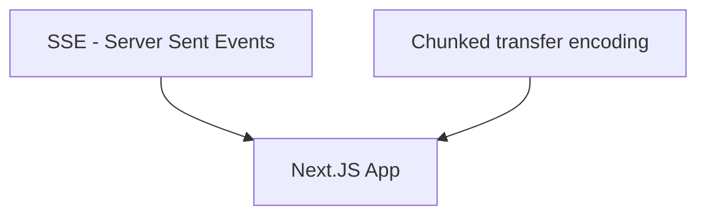

---
# try also 'default' to start simple
theme: seriph
# random image from a curated Unsplash collection by Anthony
# like them? see https://unsplash.com/collections/94734566/slidev
background: /images/background.jpg
# apply any windi css classes to the current slide
class: 'text-center'
# https://sli.dev/custom/highlighters.html
highlighter: shiki
# show line numbers in code blocks
lineNumbers: false
# some information about the slides, markdown enabled
info: |
  ## Movie Remake Generator
  Presentation slides for developers.

  Learn more at [Sli.dev](https://sli.dev)
# persist drawings in exports and build
drawings:
  persist: false
# page transition
transition: slide-left
# use UnoCSS
css: unocss
---

# Movie Remake Generator

Next.Js app Directory, Server Components, OpenAI integration and SSE streaming API

<div class="pt-12">
  <span @click="$slidev.nav.next" class="px-2 py-1 rounded cursor-pointer" hover="bg-white bg-opacity-10">
    Press Space for next page <carbon:arrow-right class="inline"/>
  </span>
</div>

<div class="abs-br m-6 flex gap-2">
  <a href="https://github.com/vLX42" target="_blank" alt="GitHub"
    class="text-xl slidev-icon-btn opacity-50 !border-none !hover:text-white">
    <carbon-logo-github />
  </a>
</div>


---
transition: fade-out
---

# What makes this tick?

<br>

I would like to cover the following:

<br>

- Next.Js new app Directory and Server and Client Components
- OpenAI (ChatGpt integration), and some AI image generation
- SSE (Server-Sent Events) Streaming API or alternative ways of streaming responses to the client.

<br>
<br>

[movie-remake.vlx.dk](https://movie-remake.vlx.dk/)


<style>
h1 {
  background-color: #2B90B6;
  background-image: linear-gradient(45deg, #4EC5D4 10%, #146b8c 20%);
  background-size: 100%;
  -webkit-background-clip: text;
  -moz-background-clip: text;
  -webkit-text-fill-color: transparent;
  -moz-text-fill-color: transparent;
}
</style>


---
layout: image-left-33
image: ./images/nextjs2.png
---

# Layout in Next.js app dir.

Layout files are nested, this is the root level

```ts {all|10|all}
export default function RootLayout({
  children,
}: {
  children: React.ReactNode;
}) {
  return (
    <html lang="en">
      <body>
        <main className={styles.main}>
          <div>{children}</div>
        </main>
      </body>
    </html>
  );
}
```


---
layout: image-left-33
image: ./images/nextjs2.png
---

# Layout in Next.js app dir.

Layout files are nested, this inside the search folder

```ts {all|11|12|all}
export default function RootLayout({
  children,
}: {
  children: React.ReactNode;
}) {
  return (
    <div>
      <h1 className={`${styles.headline} ${abril_fatface.className}`}>
        Hollywood Movie Remake Generator
      </h1>
      <MovieSearchForm />
      {children}
    </div>
  );
}
```


---
layout: image-left-33
image: ./images/nextjs2.png
---

# Search component

The search just push the search value to the url

```ts {all|1|16|8|all}
"use client";
...
const handleChange = (event: React.ChangeEvent<HTMLInputElement>) => {
  setSearchTerm(event.target.value);
  const value = event.target.value;

  if (value.length === 1) {
    router.push(`/search/${value}`);
  } else {
    debouncedSearchTerm(value);
  }
};
...
<input
  type="text"
  onChange={handleChange}
  placeholder="Search for movies"
  value={searchTerm}
/>

```


---
layout: image-left-33
image: ./images/nextjs2.png
---

# Search result

This is what is need for fetching from The Movie DB

```ts {all|2|4|6|all}
export default async function Page({ params }: { params: { search: string } }) {
  const movieData = await searchMovies(params.search);
  return (
    <Suspense fallback={<MovieSearchResultSkeleton />}>
      {/* @ts-expect-error Async Server Component */}
      <MovieSearchResult promise={movieData} />
    </Suspense>
  );
}
```
<br>
```ts {all}
export async function searchMovies(searchTerm: string): Promise<any> {
    const res = await fetch(
      `https://api.themoviedb.org/3/search/movie?api_key=${process.env.THEMOVIEDB_API_KEY}&query=${searchTerm}`,
      { method: "GET", headers: { "Content-Type": "application/json" } }
    );
}
```


---
layout: image-left-33
image: ./images/robot.jpg
---

# OpenAI

This is a simple example of OpenAi request

```ts {all|2|3-8|11|12|all}
    const payload: OpenAIStreamPayload = {
      model: "gpt-3.5-turbo",
      messages: [
        {"role": "system", "content": "You are a helpful assistant."},
        {"role": "user", "content": "Who won the world series in 2020?"},
        {"role": "assistant", "content": "The Los Angeles Dodgers won the World Series in 2020."},
        {"role": "user", "content": "Where was it played?"}
      ],
      temperature: 0.9,
      presence_penalty: 0.6,
      max_tokens: 340,
      stream: true,
    };
```

---
layout: image-left-33
image: ./images/robot.jpg
---

# OpenAI

Example of my questions

```ts {all|1-9|10-13|14-17|all}
      {
        name: "Me",
        message: `Create a modern version of the movie called "${title}" that was released in ${releaseDate}?
          The updated the plot for a modern audience by including themes of woke-ness, LGBT representation, diversity, and inclusion into the plot.
          If the main character in the original movie is male, please consider gender-swapping the character.
          Find new actors for the different roles, they should look  like the original actors. Also consider actors that are not known for mainstream movies. Don't use: Zendaya, Emma Stone, Michael B. Jordan.
          Write a medium lenght synopsis of the movie, without revealing its title.
          Including the names of the new actors`,
      },
      {
        name: "AI",
        message: "",
      },
      {
        name: "Me",
        message: "Find a title for this remake. Return title only",
      },
      {
        name: "AI",
        message: "",
      },
      {
        name: "Me",
        message: `Use the lead actor from the summary to create a character poster. Don't mentioning the character's name in the description use the actors name.
          Keep the appearance of the character faithful to the original, including clothing and style details.
          Use the main element of the movie for the background. Avoid using terms like "AI" or "generate."
          Keep the response brief, with no more than 85 words. Make it in a style like this:
          (cinematic portrait of ((super mario:1.0) and (princess peach:1.0):1.0) in ((avengers movie:1.0):1.0), (hyperrealism, skin, sharp detail, octane render, soft light:0.9), (by (dave dorman:1.0):1.1)`,
      },
```


---
layout: image-left-33
image: ./images/robot.jpg
---

# OpenAI - Stream response

Now you get the result as a stream

```ts {all|8|13|all}
        // Call the OpenAIStream function with the payload and API key
        const stream = await OpenAIStream(payload);
        const reader = stream?.getReader();
        const decoder = new TextDecoder();
        let output = "";
        let done = false;

        while (!done) {
          const { value, done: doneReading } = await reader?.read();
          done = doneReading;
          const chunkValue = decoder.decode(value);
          output += chunkValue;
          transmitToClient({ reply: i, message: chunkValue });
        }

```


---
layout: image-left-33
image: ./images/streaming.jpg
---

# Streaming the response to the client


<div class="flex justify-center items-center">

</div>
<div class="flex justify-center items-center">
  
</div>
<div class="flex justify-center items-center">
  
</div>


---
layout: image-left-33
image: ./images/streaming.jpg
---

# The Next.js way
Next.js API
```ts {all|7-9|11-13|all}
export default async function handler(
  req: NextApiRequest,
  res: NextApiResponse
) {
  const { title, releaseDate } = req.query;

  res.setHeader("Content-Type", "text/event-stream");
  res.setHeader("Cache-Control", "no-cache, no-transform");
  res.setHeader("Connection", "keep-alive");

  const sendEvent = (data: object) => {
    res.write(`event: add\ndata: ${JSON.stringify(data)}\n\n`);
  };
```
React.js code:

```ts {all|2|3-5|all}
 useEffect(() => {
    const source = new EventSource( `/api/remake?releaseDate=${releaseDate}&title=${title}`);
    source.addEventListener("add", (e: any) => {
        const json = JSON.parse(e.data);
    });
    ... error handling and cleanup
  }, []);
```
---
layout: image-left-33
image: ./images/streaming.jpg
---

# Cloudflair Worker
SSE Server Sent Events
```ts {all|1-3|8-16|21|all}
addEventListener("fetch", (event) => {
  event.respondWith(fetchAndApply(event.request));
});

async function fetchAndApply(request) {
  let { readable, writable } = new TransformStream();
  var headers = new Headers();
  headers.append("Content-Type", "text/event-stream");
  headers.append("Cache-Control", "no-cache");
  headers.append("Connection", "keep-alive");
  headers.append("Access-Control-Allow-Origin", "*");
  headers.append(
    "Access-Control-Allow-Headers",
    "Origin, X-Requested-With, Content-Type, Accept"
  );
  headers.append("Access-Control-Allow-Methods", "GET, POST, PUT, DELETE");
  const url = new URL(request.url);
  const title = url.searchParams.get("title");
  const releaseDate = url.searchParams.get("releaseDate");

  askQuestions(title, releaseDate, writable);
  return new Response(readable, init);
}
```
---
layout: image-left-33
image: ./images/streaming.jpg
---

# Cloudflair Worker
SSE Server Sent Events
```ts {all|1-5|20|all}
async function sendEvent(writer, data) {
  let encoder = new TextEncoder();
  await writer.write(encoder.encode(`event: add\n`));
  await writer.write(encoder.encode(`data: ${JSON.stringify(data)}\n\n`));
}

async function askQuestions(title, releaseDate, writable) {
      ...
      const stream = await OpenAIStream(payload);
      const reader = stream.getReader();
      const decoder = new TextDecoder();
      let output = "";
      let done = false;

      while (!done) {
        const { value, done: doneReading } = await reader.read();
        done = doneReading;
        const chunkValue = decoder.decode(value);
        output += chunkValue;
        await sendEvent(writer, { reply: i, message: chunkValue });
      }


```

---
layout: image-left-33
image: ./images/streaming.jpg
---

# AWS Lambda response streaming
```ts {all|7-14|20|all}
exports.handler = awslambda.streamifyResponse(
  async (event, responseStream, context) => {
    const queryStringParameters = event.queryStringParameters;
    const title = queryStringParameters ? queryStringParameters.title : null;
    const releaseDate = queryStringParameters ? queryStringParameters.releaseDate : null;

    const httpResponseMetadata = {
      statusCode: 200,
      headers: {
        "Content-Type": "application/json",
        "Transfer-Encoding": "chunked",
      },
    };

    responseStream = awslambda.HttpResponseStream.from(
      responseStream,
      httpResponseMetadata
    );

    await askQuestions(title, releaseDate, responseStream);

    responseStream.end();
  }
);
```
---
layout: image-left-33
image: ./images/streaming.jpg
---
# AWS Lambda response streaming
```ts {all|12|all}
      const stream = await OpenAIStream(payload);
      const reader = stream.getReader();
      const decoder = new TextDecoder();
      let output = "";
      let done = false;

      while (!done) {
        const { value, done: doneReading } = await reader.read();
        done = doneReading;
        const chunkValue = decoder.decode(value);
        output += chunkValue;
        responseStream.write({ reply: i, message: chunkValue });
      }
```


---
layout: image-left-33
image: ./images/streaming.jpg
---
# AWS Lambda response streaming
The React.js part
```ts {all|5|9-23|20-21|all}
useEffect(() => {
    const fetchData = async () => {
      try {
        const response = await fetch(`${process.env.AWS_REMAKE_URL}?releaseDate=${releaseDate}&title={title`);
        const reader = response.body?.getReader();
        const decoder = new TextDecoder("utf-8");
        if (reader) {
          let buffer = "";
          const readChunk = async () => {
            const { value, done } = await reader.read();
            if (done) {
              return;
            }
            buffer += decoder.decode(value, { stream: true });
            let newlineIndex;
            while ((newlineIndex = buffer.indexOf("\n")) !== -1) {
              const jsonStr = buffer.slice(0, newlineIndex);
              buffer = buffer.slice(newlineIndex + 1);
              if (jsonStr !== "" && jsonStr !== "[]") {
                const json = JSON.parse(jsonStr);
                ... do stuff
              }
            }

            readChunk();
          };

          readChunk();
        }
      } catch (error) {
        console.error("Error fetching data:", error);
      }
    };

    fetchData();
  }, []);
```

---
layout: image-left-33
image: ./images/streaming.jpg
---
# AWS Lambda response streaming
More information about the lambda response streaming

https://aws.amazon.com/blogs/compute/introducing-aws-lambda-response-streaming/

A code example

https://github.com/aws-samples/serverless-patterns/tree/main/lambda-streaming-ttfb-write-sam